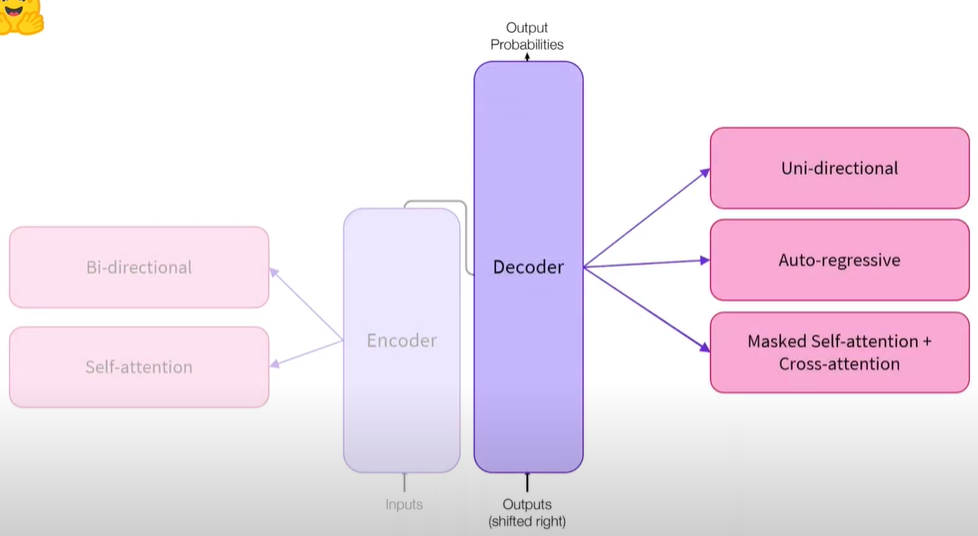
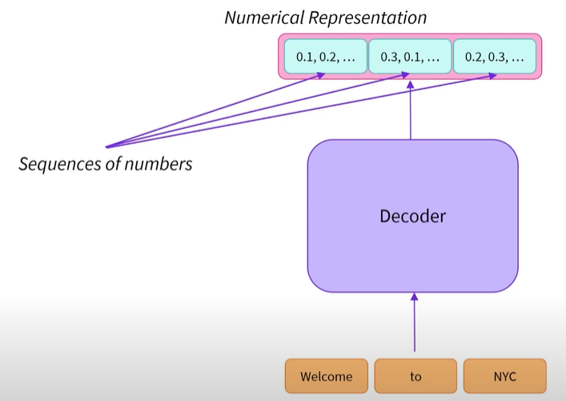
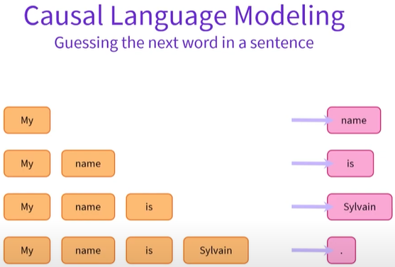

# Decoder Models

Decoder models use only the decoder of a Transformer model

At each stage, for a given word, the attention layers can only access the words positioned before it in the sentence

These models are often called auto-regressive models

The pretraining of decoder models usually revolves around predicting the next word in the sentence

Best suited for tasks involving text generation



The decoder outputs numerical representations/feature vectors/feature tensors from the initial sequence 



### Masked Self-Attention Mechanism

The vector of words are only affected by the words on the left (left context). Words on the right (right context) are masked

### When to Use

```Unidirectional```: Access only to their left/right context

Therefore, great at text generation i.e. Casual Language Modelling or Natural Language Geneation


### Example of Casual Language Modelling

Start with initial word "My" as input for the decoder. The model outputs a vector of numbers representing a single word. We apply a transformation to that vector such that it maps to all the words known by the model i.e. language modelling head. Identify the most probable following word, example "Name". We add that word to the initial sequence. 

```Auto-regressive``` models reuse their past outputs as inputs in the following steps



