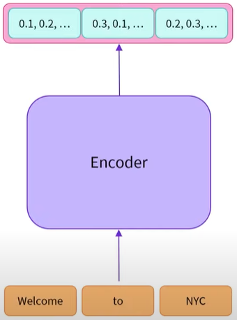
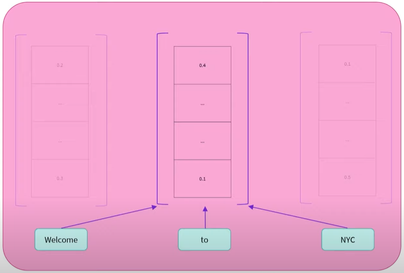

# Encoder Models

Encoder models use only the encoder of a Transformer model

At each stage, the attention layers can access all words in the initial sentence. These models are said to have ```bi-directional``` attention and are often called ```auto-encoding``` models

The pretraining invovles somehow corrupting a given sentence, for example masking random words in it, and tasking the model to find or reconstruct the initial sentence

Encoder models are suited for tasks requiring an understanding of the full sentence. They are good at natural language understanding. Powerful at extracting vectors that carry meaninful information about a sequence. For example:
- Sentence/sequence classification
- Sentiment analysis
- Named Entity Recognition, and more generally word classification
- Extractive question answering
- Masked language modeling



The encoder outputs a numerical representation/feature vector/feature tensor for each word used as input

Dimension of the feature vector is defined by the architecture of the model



The feature vector of each word takes into account the words around it i.e. context. A contexualised value, it holds the meaning of the word within the text, thanks to the self-attention mechanism. The representation of a word has been affected by other words in the sequence

Further Reading
- https://jalammar.github.io/illustrated-transformer/
- https://jalammar.github.io/illustrated-gpt2/
- https://jalammar.github.io/visualizing-neural-machine-translation-mechanics-of-seq2seq-models-with-attention/
- https://nlp.seas.harvard.edu/2018/04/03/attention.html

