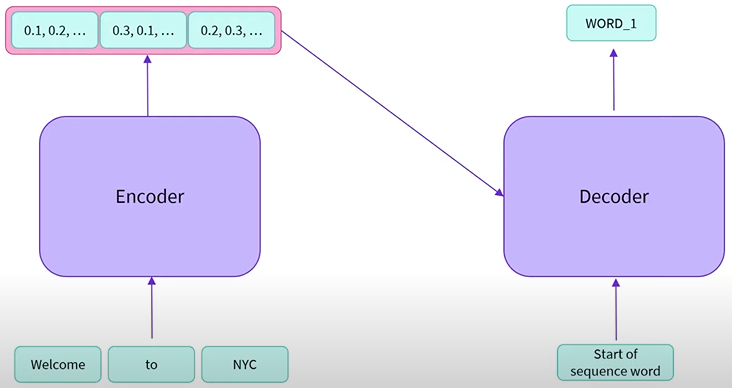
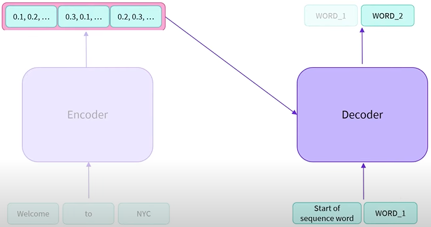
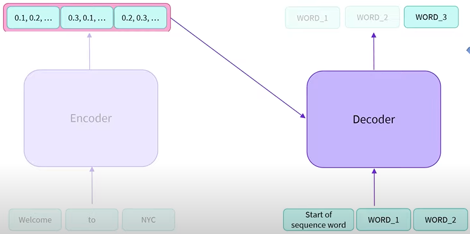
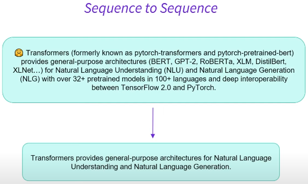

# Sequence to Sequence Models 

Sequence-to-Sequence models are also known as Encoder-Decoder models and use both parts of the Transformer architecture

Sequence-to-sequence models are best suited for tasks revolving around generating new sentences depending on a given input
- Summarization
- Translation
- Generative Question Answering

### How it works



The encoder accepts a sequence as input and outputs a numerical representation of the sentence (encoded the sequence/an understanding of the sequence). The output of the encoder is passed to the decoder. The decoder also receives a sequence. 
- When prompting the decoder for an output with no initial sequence yet, we can give it a value that indicates the start of the sequence.

The decoder uses the encoder's output + input sequence will start to decode the sequence. It decodes the sequence and outputs a word

Once we have the encoder's numerical representation and the initial generated word, we don't need the encoder anymore



The decoder acts in an ```auto-regressive``` manner. The word it has just output can now also be used as an input (uses its previous outputs). It uses the encoder's output and the word it just generated to generate a second word 



Continue on and on until the decoder outputs what we consider to be a stopping value

### Encoders and Decoders

The ```encoder``` is trained to understand the sequence and extract the relevant information. For example in translation, this means parsing and understanding the English language. Extracting information and putting it into a vector that is dense in information.

The ```decoder``` takes care of generating a sequence according to the understanding of the encoder.

Tasks: Seq-to-Seq tasks, translation, summarisation

The weights are not necessarily shared across the encoder and decoder

The output length is also independent of the input length in encoder-decoder models 

Example, summarisation:



Since the encoder and decoders are separated, we can have diff context lengths. For example, a very long context for the encoders which handles the text, and a smaller context for the decoder which handles the summarised sequence

### Models

There are many popular SeqtoSeq models in the Transformers library such as BART, T5 etc.

We can also load an encoder and decoder inside an encoder-decoder model (buuilding seq2seq models from separate encoders and decoders) based on specific tasks 