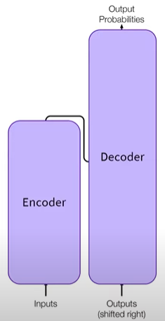
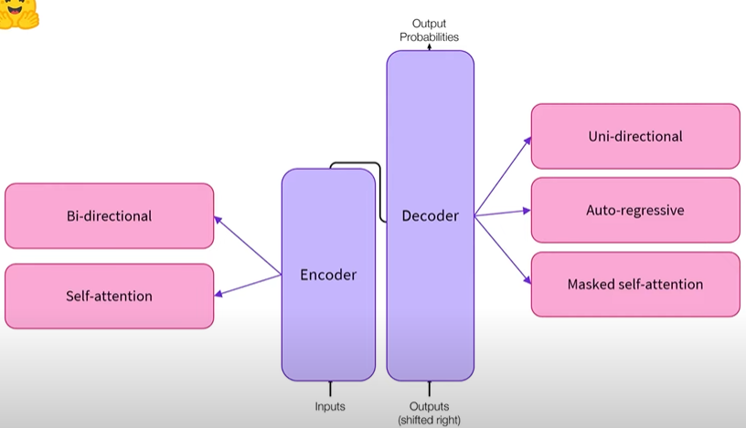

# High-Level look at the Architecture of Transformer Models

## Categories of Transformer Models
1. Auto-regressive transformer models. Example: GPT
2. Auto-encoding transformer models. Example: BERT
3. Sequence to sequence transformer models. Example: BART/T5

## Transformers are Language Models
#### General Pretrained
Transformers are trained on large amounts of raw text in a self-supervised fashion (self-supervised learning)
- Humans are not needed to label the data

This step results in the model developing a statstical understanding of the language. However, it is not yet useful for specific practical tasks

#### Transfer Learning
That is why the ```general pretrained model``` goes through a process called ```transfer learning``` 

Model is fine-tuned in a supervised way i.e. using human-annoted labels on a given task. Examples:
1. Casual Language Modeling: Predict the next word in a sentence having read the n previous words. Output depends on the past and present inputs

2. Masked Language Modeling: Model predicts a masked word in the sentence

## Transformers are Big Models

The general strategy to achieve better performance is by increasing the model size (number of parameters) as well as the amount of data they are pretrained on 

## Transfer Learning

Leverage the knowledge acquired by a model trained with lots of data on another task. Ex. Model A is trained specifically for Task A. We want to Train Model B for a different task. Training from scratch is too costly (All the model's weights are initialised randomly). Instead we can initialise Model B with Model A's weights, transfering the knowledge of Model A to Task B

Training from scratch requires more data and computation to achieve comparable results to Fine-tuning a pretrained model

In practice, transfer learning is applied on a given model by throwing away its head (last layers focused on the pretraining objective) and replacing it with a new, randomly initialised head suitable for the task. The body of the model is kept. For example, fine-tune a BERT model by removing the head that classified mask words and replaced it with a classifier with 2 outputs, since the new task has 2 labels. To be efficient, the pretrained model used should be a similar as possible to the task it will be fine-tuned for 

Downside: THe pretrained model helps by transfering its knowledge but it also transfers its bias/downsides it may contain

### Pretraining
Pretraining is the act of training a model from scratch: weights randomly initialised and training starts without any prior knowledge. It is usually done with a lot of data

### Fine-tuning
Fine-tuning is training done after a model has been pretrained. 

To perform fine-tuning: First acquire pretrained language model, then perform additional training with a dataset specific to your task

Finetuning vs Traning a new model from scratch for final use case:
- Pretrained model was already trained on a dataset that has some similarities with the fine-tuning dataset. The fine-tuning process is thus able to take advantage of knowledge acquired by the initial model during pretraining
- Pretrained model was already trained on lots of data, the fine-tuning requires way less data to get decent results
- Amount of time and resources needed to get good results are much lower
- Lower time and data

Knowledge the pretrained model has acquired is 'transfered'. Example: One could leverage a pretrained model trained on the English language and then fine-tune it on an arXiv corpus, resulting in a science/research-based model

This process will achieve better results than training from scratch (unless you have lots of data), which is why you should always try to leverage a pretrained model — one as close as possible to the task you have at hand — and fine-tune it

## General Architecture



The transformer architecture has 2 parts: Encoder and Decoder

They can be used together and also used independently 



```Encoder``` accepts inputs that represents text and converts the words to numerical representations/embeddings/features. "Encodes" text into numerical representation. 
- Receives an input and builds a representation of it
- Optimised to acquire understanding from the input
- Has self-attention mechanism and bi-directional properties
- Encoder-only models: Good for tasks that require understanding of the input. For example: sentence classification and NER

```Decoder``` "decodes" the representations from the encoder
- Uses the encoder's representation along with other inputs to generate a target sequence
- Optimised for generating outputs 
- Can also accept text inputs
- Uses masked self-attention (similar to encoder)
- Uni-directional feature
- Used in an auto-regressive manner
- Decoder-only models: Good for generative tasks such as text generation

The combination of the 2 parts is known as an ```encoder-decoder``` or a ```sequence-to-sequence transformer```. ```Encoder``` accepts inputs and computes high level representation of those inputs. The output is passed to the ```Decoder```. The ```Decoder``` uses the output, alongside other input, to generate a prediction/output. The output is used in future iterations, hence the term ```auto-regressive```
- Encoder-decoder models/Sequence-to-sequence models: Good for generative tasks that require an input such as translation or summarisation

## Attention Layers

A Key feature of Transformer models

Tells the model to pay specific attention to certain words in the sentence you passed it (and more or less ignore the others) when dealing with the representation of each word. For example in translation, the model may need to pay special attention to words that might appear farther away in the sentence to properly translate each word

Can also be used in the encoder/decoder to prevent the model from paying attention to some special words — for instance, the special padding word used to make all the inputs the same length when batching together sentences

## Original Architecture

The Transformer architecture was originally designed for translation

During training, encoder receives inputs (sentences) in a certain language, while the decoder recieves the same sentences but in the desired language

The attention layers in the encoder can use all the words in a sentence. The attention layers in the decoder can only pay attenton to the words in the sentence it has already translated i.e. the words before the word currently being generated. For example, when we have predicted the first 3 words of the translated target, we give them to the decoder which then uses all the inputs of the encoder to try to predict the 4th word

To speed up training (when the model has access to target sentences), the decoder is fed the whole target but it is not allowed to use future words. For instance, when trying to predict the 4th word, the attention layer will only have access to the words in positions 1 to 3.

Note that the first attention layer in a decoder block (referencing original transformer architecture) pays attention to all (past) inputs to the decoder, but the second attention layer uses the output of the encoder. It can thus access the whole input sentence to best predict the current word

## Extra Terminology 

- Architecture: Skeleton of the model — the definition of each layer and each operation that happens within the model

- Checkpoints: Weights that will be loaded in a given architecture

- Model: Umbrella term that isn’t as precise as “architecture” or “checkpoint”: it can mean both. This course will specify architecture or checkpoint when it matters to reduce ambiguity